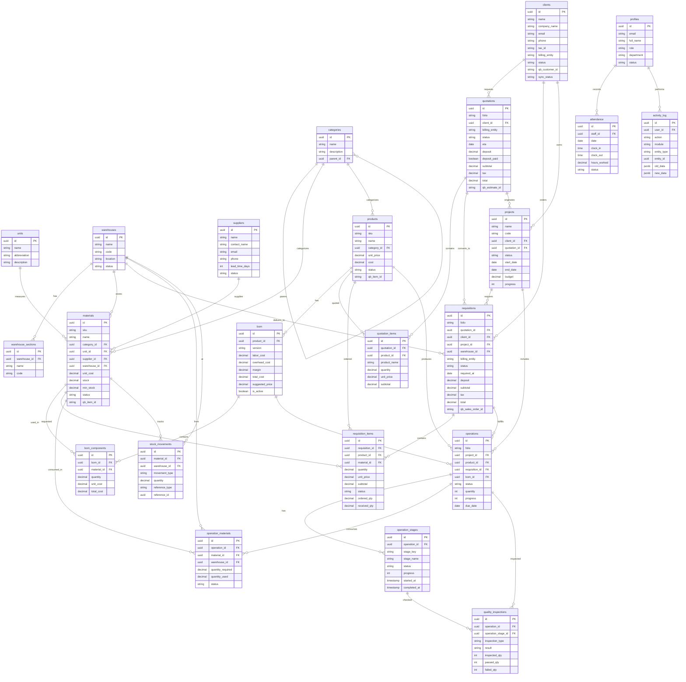
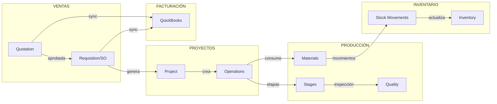
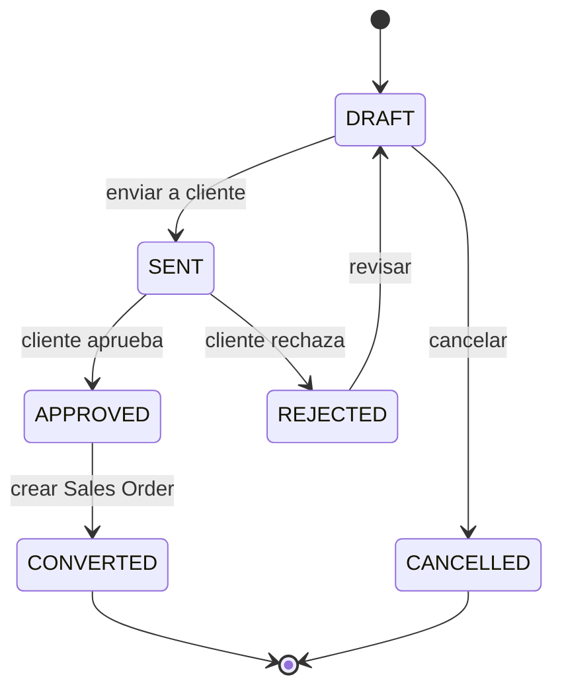
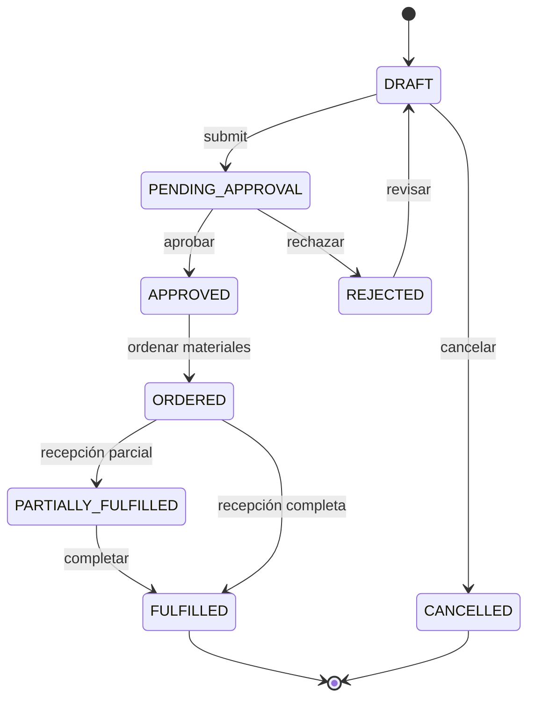
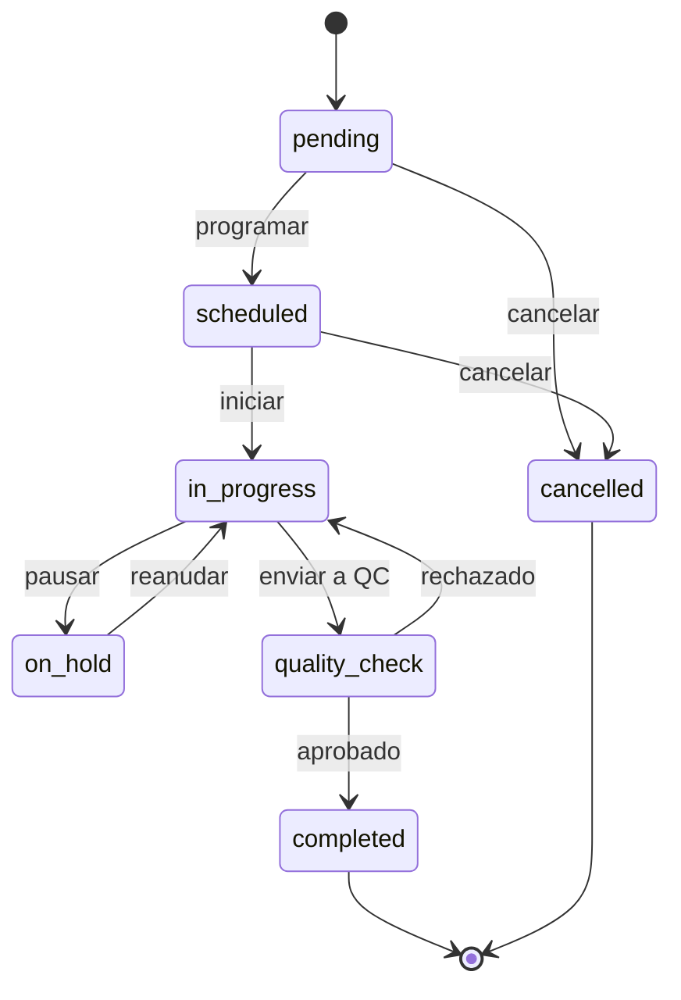
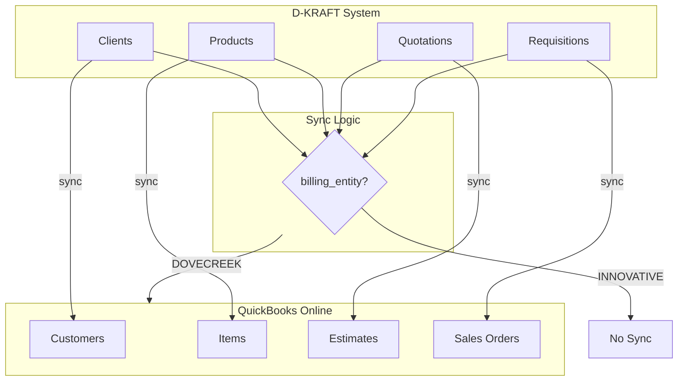

# D-KRAFT Database Schema Diagram

## Entity Relationship Diagram

## Flujo de Datos Principal

## Flujo de Status - Quotations

## Flujo de Status - Requisitions (Sales Orders)

## Flujo de Status - Operations

## Relación con QuickBooks

## Tablas por Módulo

| Módulo | Tablas Principales | Tablas Relacionadas |
|--------|-------------------|---------------------|
| **Catálogos** | categories, units, warehouses | warehouse_sections |
| **Clientes** | clients | quotations, requisitions, projects |
| **Proveedores** | suppliers | materials |
| **Materiales** | materials | stock_movements, bom_components, operation_materials |
| **Productos** | products | bom, quotation_items, operations |
| **BOM** | bom | bom_components |
| **Cotizaciones** | quotations | quotation_items |
| **Sales Orders** | requisitions | requisition_items |
| **Proyectos** | projects | operations, requisitions |
| **Operaciones** | operations | operation_stages, operation_materials |
| **Calidad** | quality_inspections | - |
| **Staff** | profiles | attendance, performance_metrics |
| **Auditoría** | activity_log | - |

## Campos Clave para QuickBooks

| Tabla | Campo QB | Descripción |
|-------|----------|-------------|
| clients | qb_customer_id | ID del Customer en QB |
| clients | sync_status | Estado de sincronización |
| products | qb_item_id | ID del Item en QB |
| materials | qb_item_id | ID del Item en QB |
| quotations | qb_estimate_id | ID del Estimate en QB |
| requisitions | qb_sales_order_id | ID del Sales Order en QB |
| * | skip_qb_sync | Flag para saltar sync |
| * | billing_entity | DOVECREEK syncs, INNOVATIVE no |
